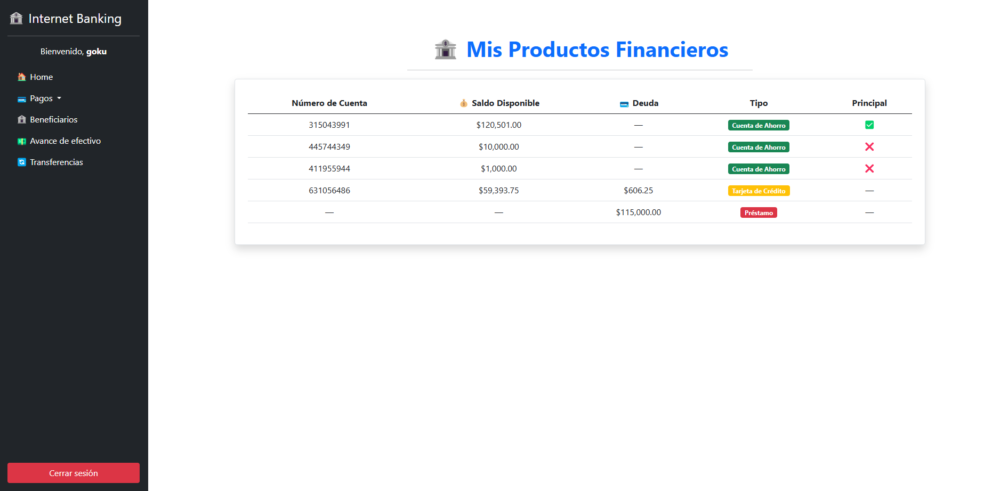

# Internet Banking Application

This project is an Internet Banking system developed with **ASP.NET Core MVC** (.NET 8) following the **Onion Architecture** pattern.

## 📖 About the Project

The Internet Banking App allows two types of users: **Administrators** and **Clients**.

Main functionalities include:

- **Login and Security**:
  - User authentication with role-based redirection.
  - Unauthorized access protection using Identity and Authorize filters.
- **Administrator Features**:
  - Dashboard with system indicators.
  - User management (create, edit, activate/deactivate users).
  - Manage client accounts and products (savings accounts, credit cards, loans).
- **Client Features**:
  - View assigned financial products.
  - Manage beneficiaries.
  - Perform express payments, credit card payments, loan payments.
  - Perform cash advances.
  - Transfer money between own accounts.

## 🖥️ Technologies Used

### Frontend
- HTML
- CSS
- Bootstrap
- ASP.NET Razor Pages

### Backend
- C# with ASP.NET Core MVC 8
- Microsoft Entity Framework Core
- Microsoft Entity Framework Core SQL Server
- Microsoft Entity Framework Core Tools
- Microsoft Entity Framework Core Design
- Entity Framework Code First

### Architecture
- Onion Architecture
- Identity for user authentication and authorization
- AutoMapper for mapping ViewModels, Entities, and DTOs
- Generic Repository and Service Pattern
- FluentValidation for ViewModel validations

### ORM
- Entity Framework Core

### Database
- SQL Server

## 📸 Project Images

### Login Screen


### Admin Dashboard


### Client Home (Product List)


## 📋 Prerequisites

Before running the Internet Banking App, make sure you have the following installed:

- Visual Studio 2022 or later
- ASP.NET Core 8
- SQL Server (local or remote)

## 🚀 Installation

1. **Download** the project or clone it.
   
2. **Open** the project in Visual Studio 2022.

3. **Configure** the database connection:
   - Open the `appsettings.Development.json` file.
   - Update the `Server` name to match your local environment, for example:

     ```json
     {
       "ConnectionStrings": {
         "DefaultConnection": "Server=YourServerName;"
       }
       // other configurations...
     }
     ```

4. In Visual Studio, go to:

   - **Tools > NuGet Package Manager > Package Manager Console**

5. In the **Package Manager Console**:
   - Make sure the Web Application project is selected as the **Default Project**.
   - You can select it from the dropdown menu in the Package Manager Console.

6. In the console, run the following command:

   ```bash
   Update-Database

7. Run the project:
    - Press F5 or click the Run button. The application will launch automatically in your default web browser.
